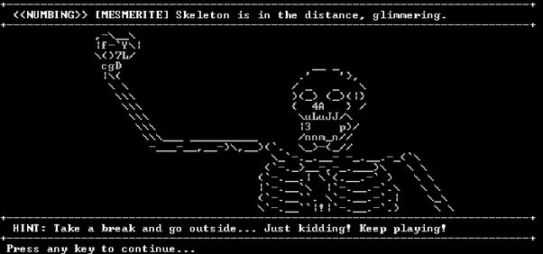

  <h1>Welcome to DUNGEONS & PYTHONS</h1>

   

---

  <h2>About the Project ⚔️🐍	</h2>

  

    Welcome to my first GitHub project, "DUNGEONS & PYTHONS"! This project is a text-based game inspired by the adventurous world of Dungeons and Dragons, implemented using basic Python functionalities.
  

  
  <h3>Objective:</h3>
  

    The objective of this project is to provide an interactive gaming experience where players navigate through a fantasy realm filled with challenges, quests, and mythical creatures, all through text-based interactions.
  

  
<h3>Methodology:</h3>
  

    The game is developed entirely in Python, utilizing fundamental concepts. Players make choices and navigate through the game by responding to prompts and challenges presented in the console.
  

---

<h2>Project Structure :open_file_folder:</h2>

  This project consists of a single Python script that serves as the main game engine. The script contains all the necessary code to run the game and guide players through their adventures in the world of Dungeons and Pythons.

---

<h2>Project Development Time ⏰ </h2>

    The development of this project spanned over a period of 5 days, during which I dedicated my efforts to designing and implementing the game mechanics, creating engaging storylines, and refining the user experience.
  

---

  <h2>Conclusion :eye:</h2>

  

   Through this project, I aimed to showcase my proficiency in Python programming and my creativity in developing interactive experiences. "DUNGEONS & PYTHONS" represents my first step into GitHub aswell.
  

  

    I hope you enjoy playing "DUNGEONS & PYTHONS" as much as I enjoyed creating it. Thank you for your attention, and stay tuned for more exciting projects in the future!
  

  

    Best regards and see you in other adventures! 🎲🐍
  

